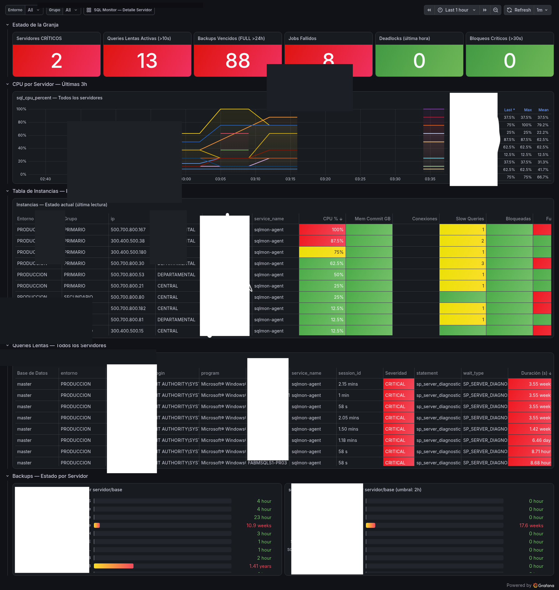
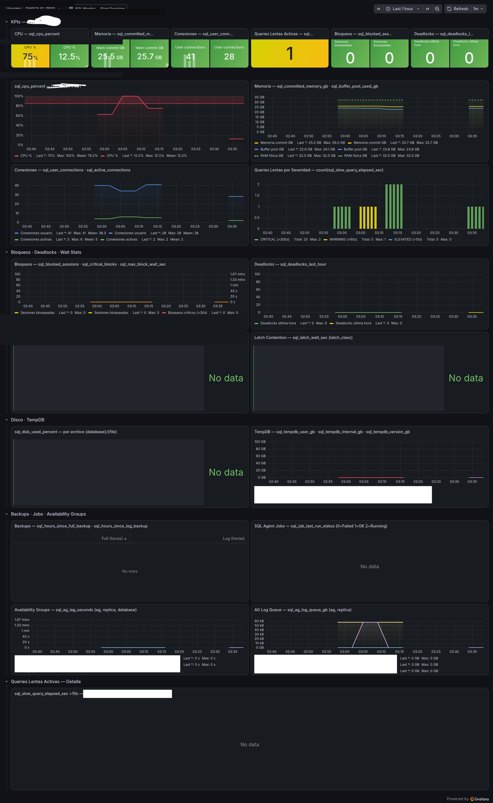

# -sqlmon-agent
SQL Server monitoring agent → Grafana Cloud via OTLP. Cost: $0
# sqlmon-agent 🚀

Agente Python de monitoreo para SQL Server → Grafana Cloud via OTLP.
**Costo operativo: $0**

## Screenshots

## Requisitos
- Python 3.6+
- pyodbc + ODBC Driver 17 o 18 for SQL Server
- Cuenta Grafana Cloud (plan gratuito)

## Instalación
pip install opentelemetry-api opentelemetry-sdk \
            opentelemetry-exporter-otlp-proto-http \
            pyodbc

## Configuración
export GRAFANA_CLOUD_USERNAME="tu_user_id"
export GRAFANA_CLOUD_API_KEY="tu_api_key"

python sqlmon-agent-otlp-v8.py -c sqlmon-agent.conf

## servers.txt — formato
NOMBRE|IP|INSTANCIA|PUERTO|ENTORNO|GRUPO|REGION|PRIORIDAD|CONTACTO|USUARIO|PASSWORD

## Qué monitorea
- CPU, memoria, conexiones
- Queries lentas con texto SQL exacto
- Bloqueos y wait stats
- Backups, Jobs, Availability Groups
- Deadlocks, Latch contention
- Espacio en disco
